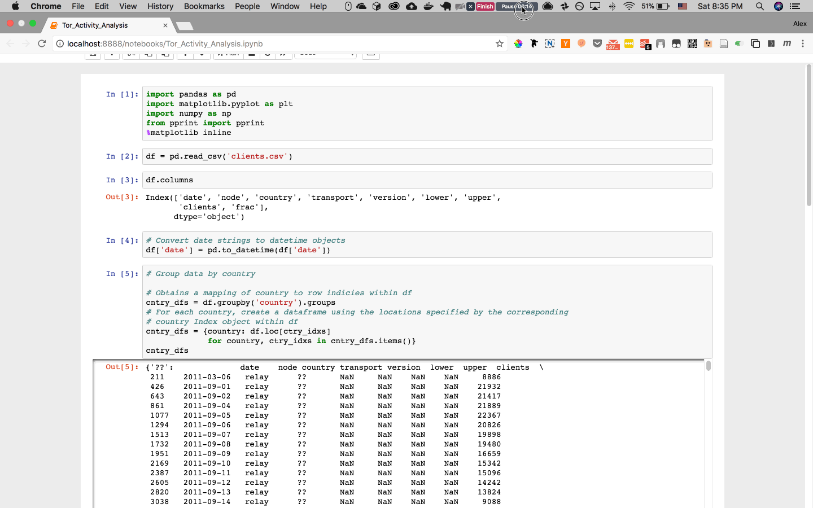

Tor Activity Analysis
=====================

Just some simple starter notebook I worked with JD at Code and Coffee

Usage
-----
Create a virtualenv in the project

```bash
pip install virtualenv # if not already installed

mkdir .env
cd .env
virtualenv .
cd ..
source .env/bin/activate
pip install requirements.txt
```

Run the Jupyter Notebook
```
jupyter notebook
```

Run all cells


